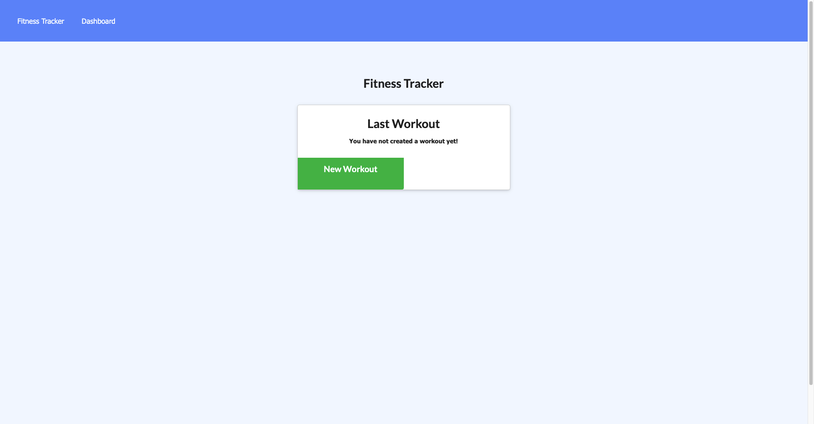
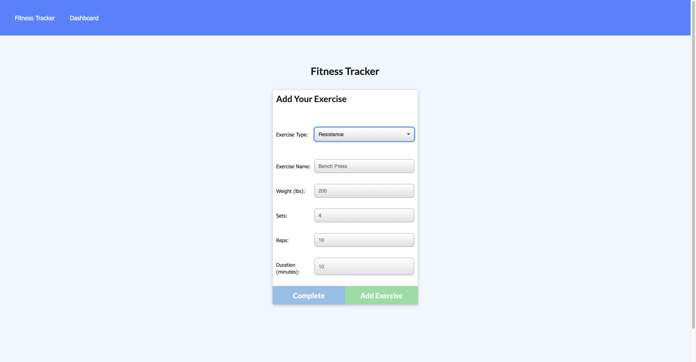
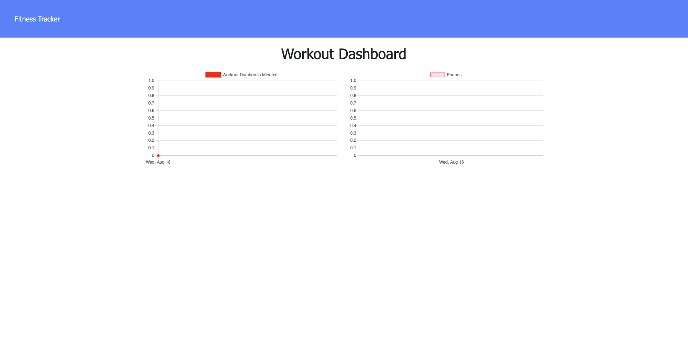

# Workout Tracker

[Deployed App](https://intense-tundra-33448.herokuapp.com/)
## Table of Contents

- [Instructions](#instructions)
- [Questions](#questions)
- [License](#license)

## Description:

This web application is designed for users who would like to track their exercises!

## Instructions
```
[Fitness Tracker](https://intense-tundra-33448.herokuapp.com/) Click the link to reach the application!

    
```
```
By clicking the `New Workout` button you are prompted with a two questions on the type of workout!
Users are prompted with more questions based on the first choice:
    * Resistance
        * Exercise Name
        * Weight (lbs)
        * Sets
        * Reps
        * Duration (minutes)
```

```
    * Cardio
        * Name
        * Distance(miles)
        * Duration 
```
```
When users click on the `Fitness Tracker` button they are navigated back to the homepage.
When users click on the `Dashboard` button they are navigated to the dashboard where you can view all information on the added workout!
```


## Questions

If you have any questions, contact me [GITHUB](https://www.github.com/kcmuse) or my [eMail](kcmusedev@gmail.com)

## License

MIT License